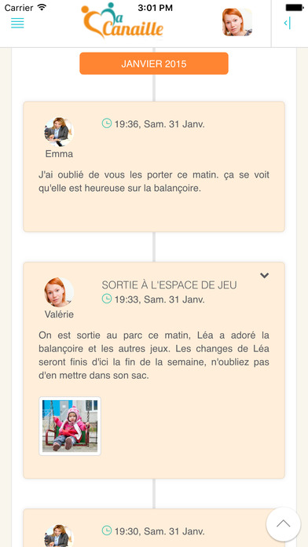
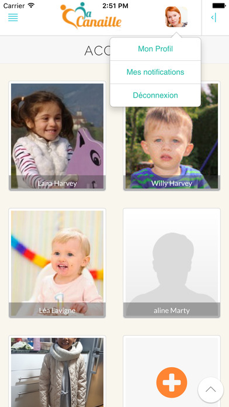
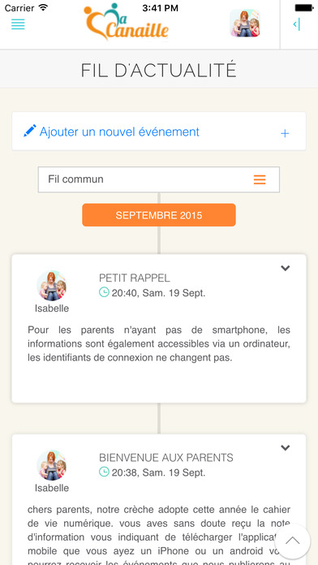

  
  
  

**Macanaille** is the simple, confidential and secure to communicate indefinitely with those who welcome your child.

**Macanaille** The application also allows you to give the nanny and the crib all information essential to the proper daily home your child:

 - A card information

 - Eating habits and allergies

 - Sleep Patterns

 - The doctor's contact information

 - Notable developments

<strong>Link:</strong> <a href="https://itunes.apple.com/us/app/macanaille-cest-le-cahier/id978168907?mt=8&at=&ct=&ign-mpt=uo%3D6">AppStore</a>
