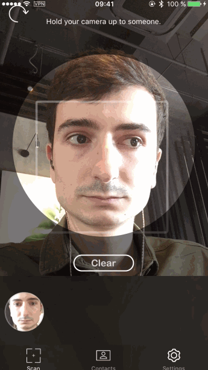

**Facemotion** it's an iOS app, allowing you to find easily a contact by face recognition.

Scan the face of a person, whether the contact is in the local storage, it can be detected by the recognition algorithm.

Or add the detected frames to a new contact among your own iOS contacts. And then can be recognise later by the application.

<strong>Source:</strong> <a href="https://github.com/remirobert/Facemotion"><i class="large github icon"></i>remirobert/Facemotion</a>
