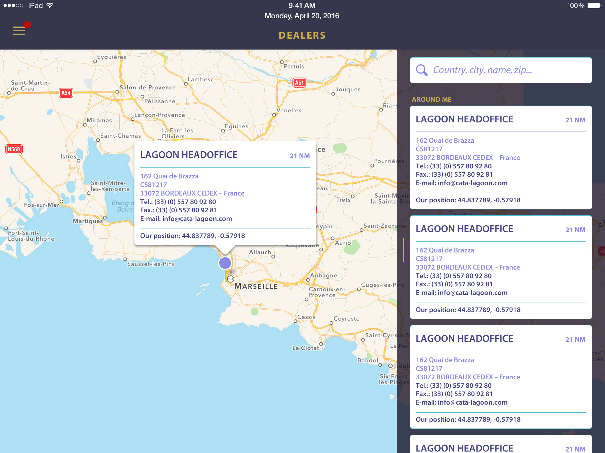

  
  

**Searinity**, is an iPad application, for managing servicing, maintenance, and shipping in a ship.
Keeping the travel location, and send issues (engine, etc).

The application is working in offline mode, and synchronize the data, when a stable connection is available.

Full swift application, **VIPER** architecture (with reactive programming **RXSwift**), with REST API, and offline data (**Realm**).
