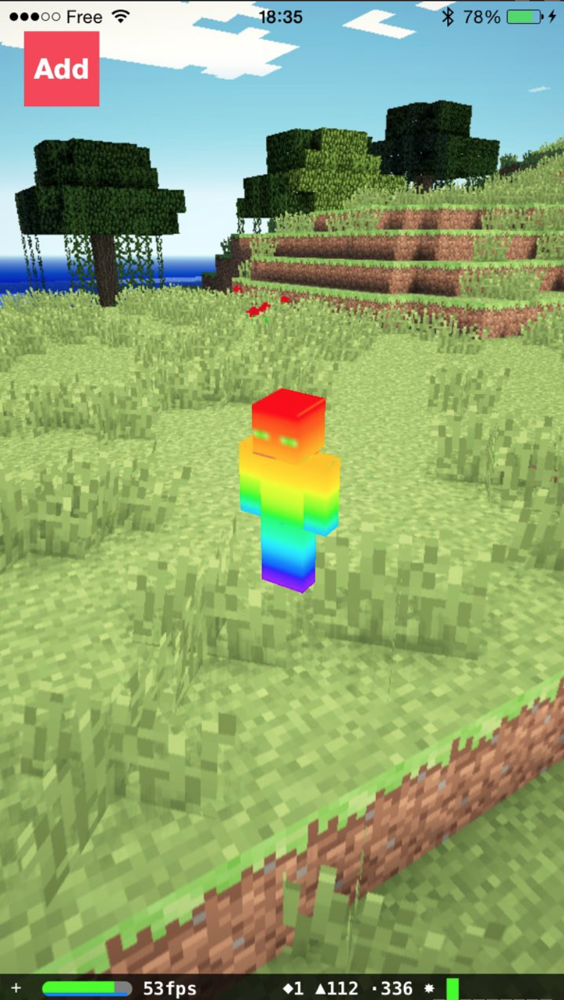
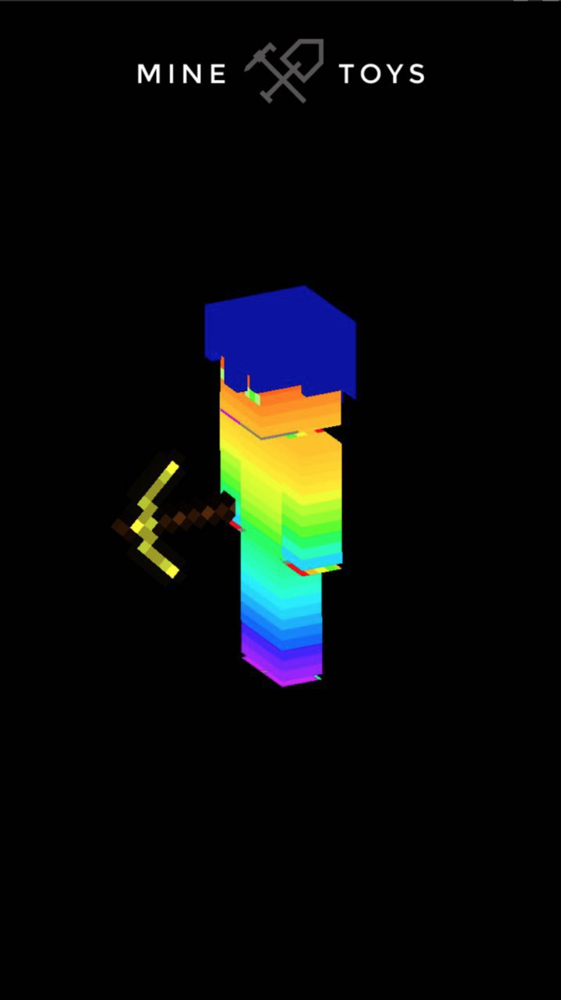
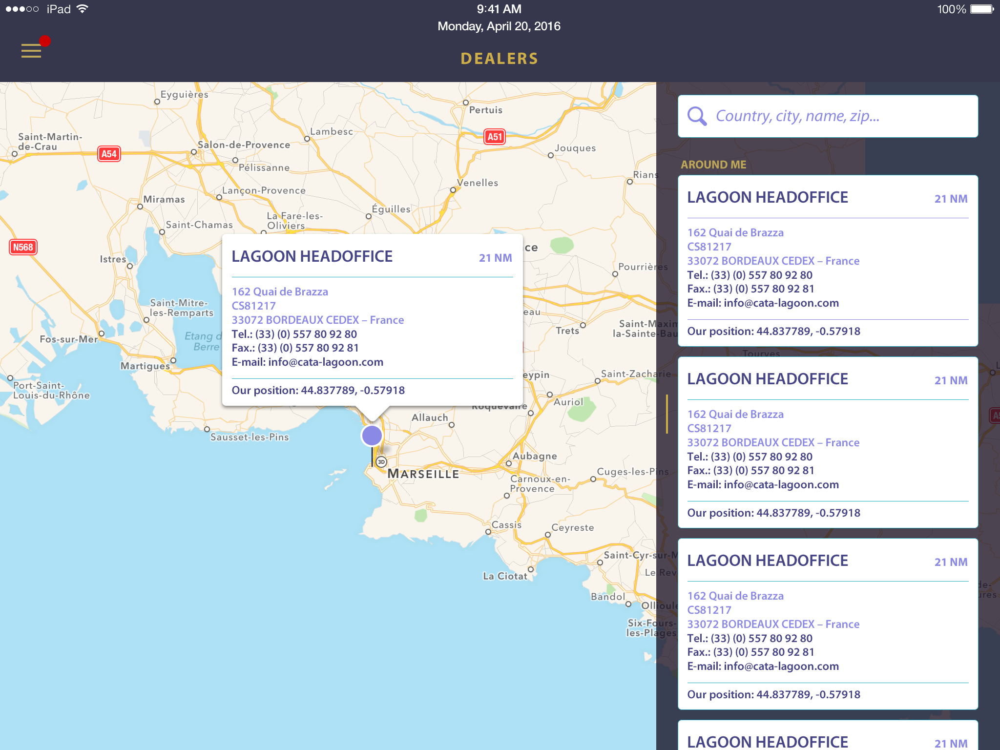

  
  

This avatar builder allows to create its modeled his **minecraft** avatar and customize it.

By adding back items (weapons, equipment), customizing the visual (posture and animation).
The application also allows to print his avatar in 3D. And thanks to the plugin integrates in the application.
