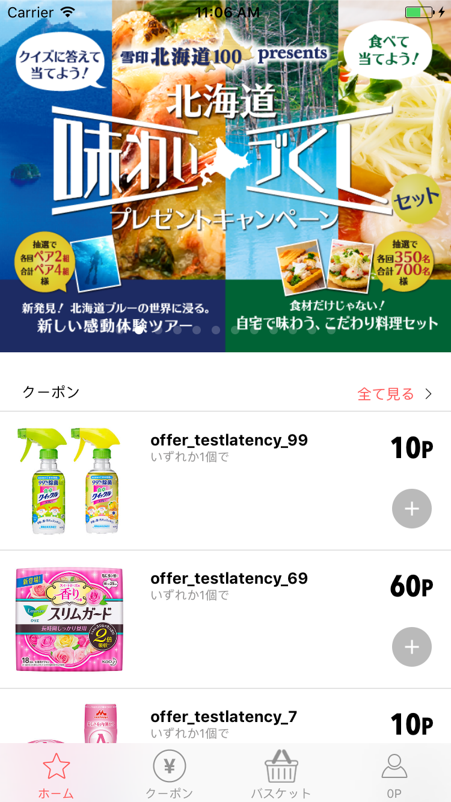
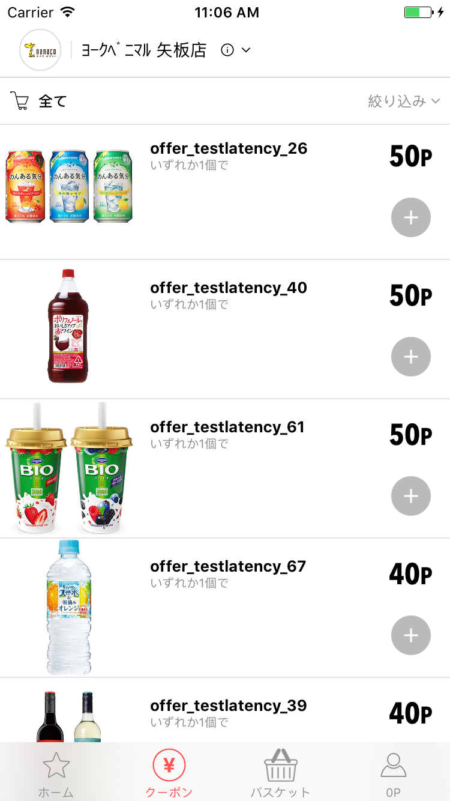
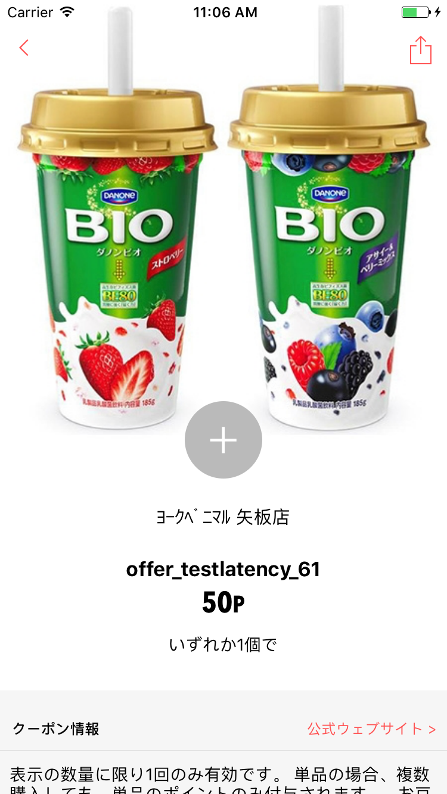
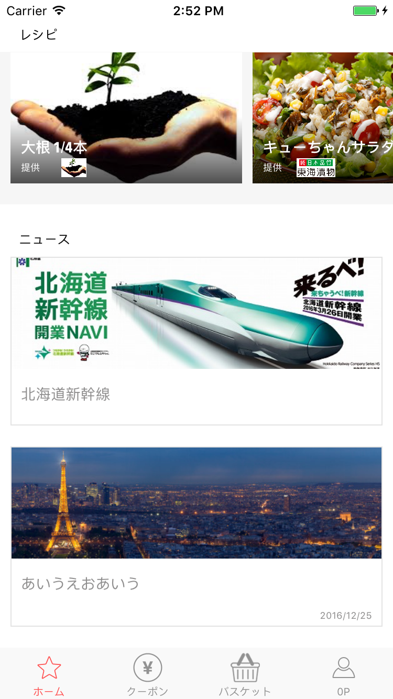

  
  
  
  

 

With Coupon Network, take advantage of coupons from different offers available every day and at all brands in Japon.

「カタリナ」は、いつものお買い物でもっとポイントがもらえる、スマートクーポンアプリです。
全国どこのお店でもクーポンが使えるようになりました

<strong>Link:</strong> <a href="https://itunes.apple.com/cg/app/sumatokupon-katarina/id887483616?mt=8">AppStore</a>
