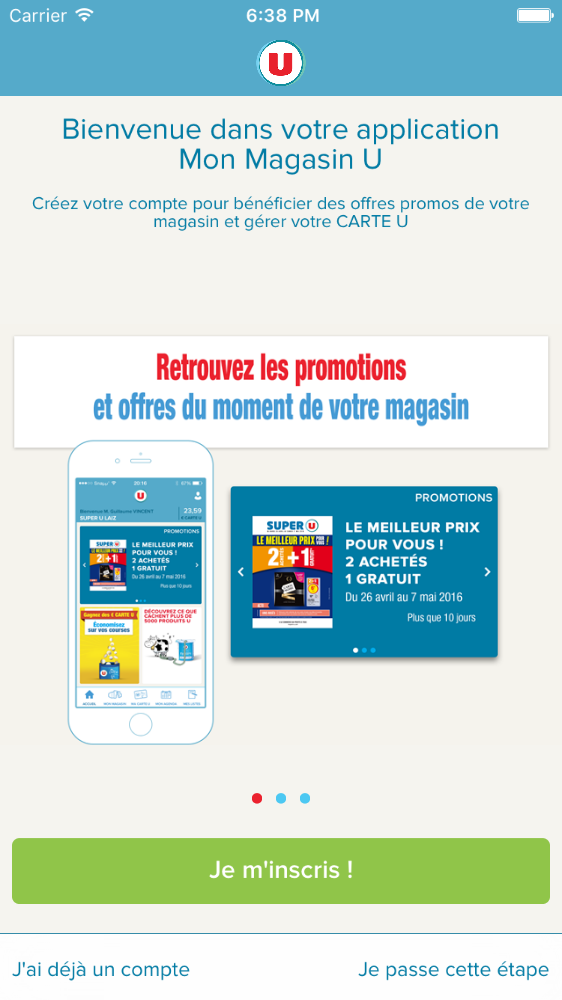
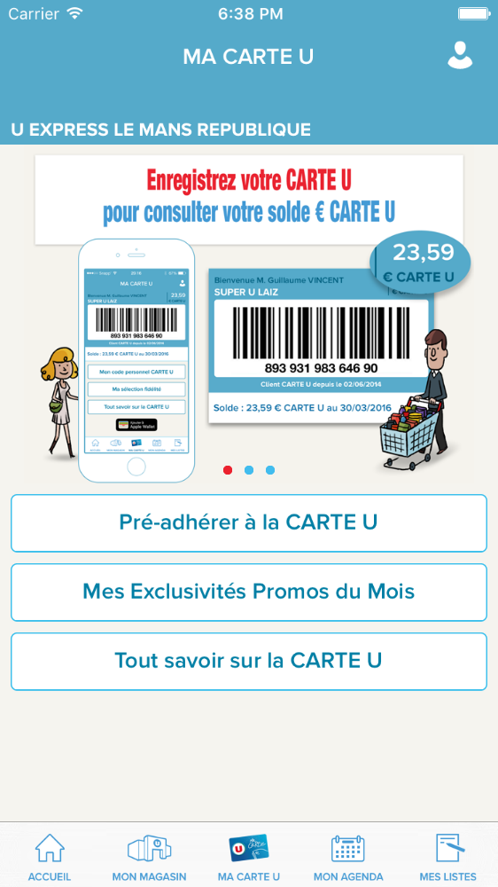
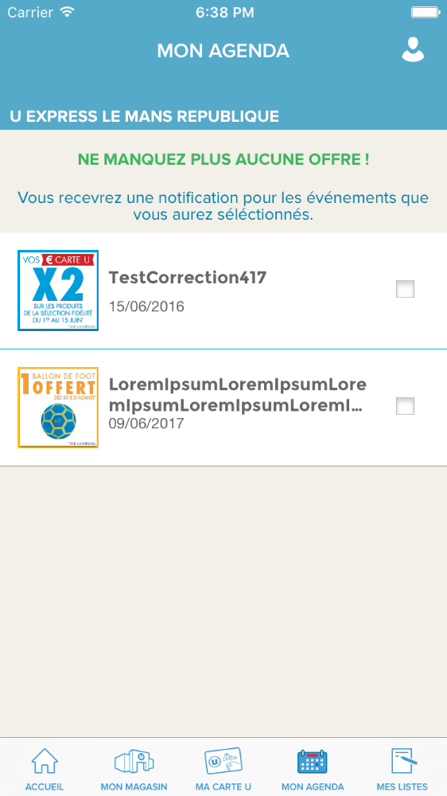
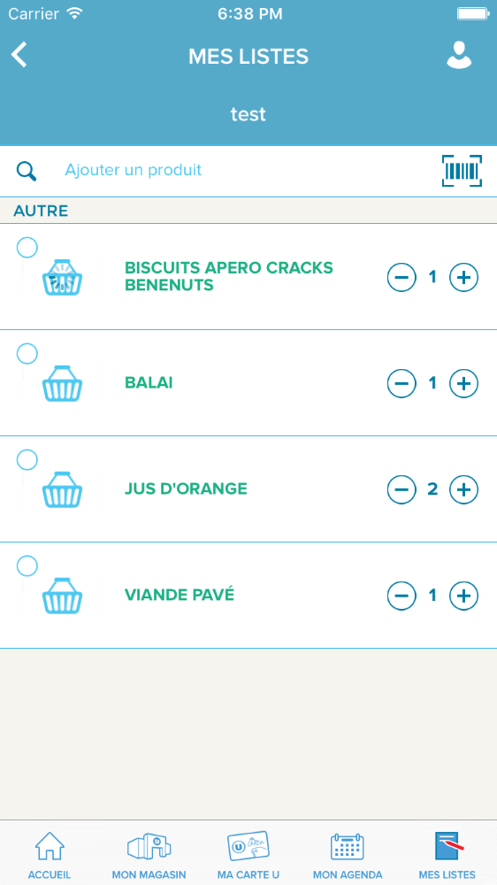
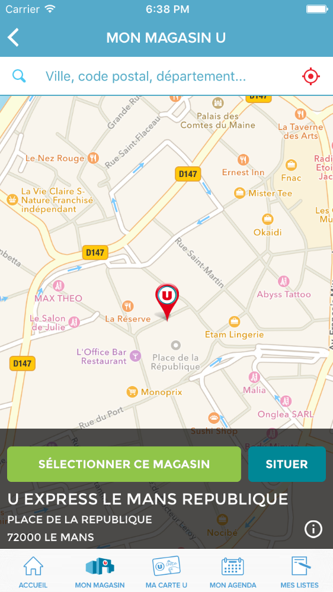

  
  
  
  
  

 

Prepare your courses and take advantage of the services of your supermarket or hypermarket, anywhere, everything with the mobile application My Store U! Find all offers, promotions catalogs and top deals U Card from Super U, Hyper U or U Express stores in your pocket.

At home, at work, or on vacation, your Stores application You have the possibility to prepare your next lessons your stores: Super U, Hyper U or Uexpress.

<strong>Link:</strong> <a href="https://itunes.apple.com/us/app/mon-magasin-u-promotions-et/id479847099?mt=8">AppStore</a>
