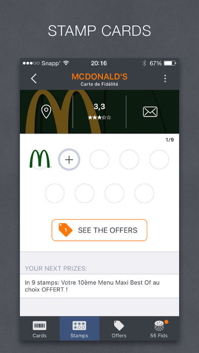
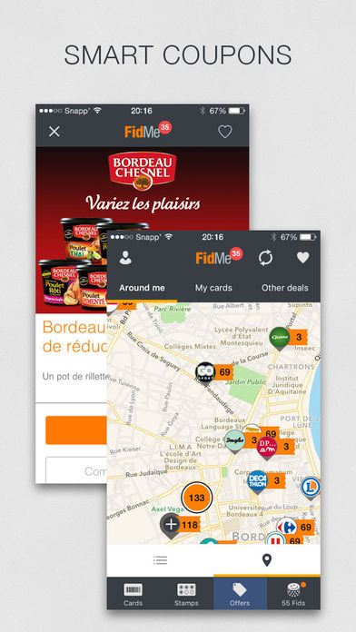
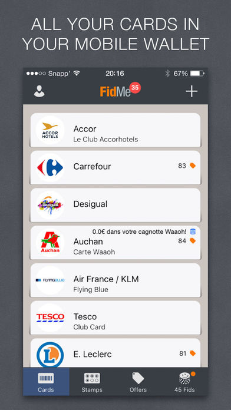

  
  
  
  

 

FidMe gathers all your loyalty cards (barcode and stampcards), coupons and deals on your phone. No more plastic cards, paper ads, no more forgotten or lost cards! Let your wallet breathe and save money!

<strong>Link:</strong> <a href="https://www.fidme.com/en">Website</a>
<strong>Link:</strong> <a href="https://itunes.apple.com/app/id391329324?mt=8">AppStore</a>
