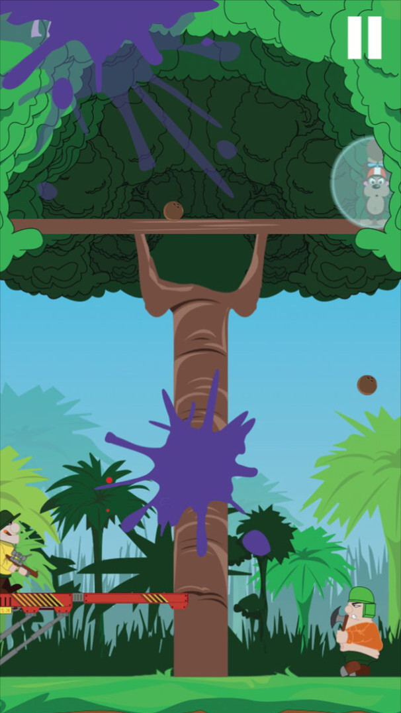

Bao monkey is a mobile game for iPhone and iPa d, made with **SpriteKit** Framework.

Bao is a little monkey who lives in a beautiful tree.

Unfortunately some lumberjacks, hunters, commandos and many others want to destroy it !

Help Bao to protect his home !

<strong>Source:</strong> <a href="https://github.com/remirobert/BaoMonkey"><i class="large github icon"></i>remirobert/BaoMonkey</a>
 
<strong>Link:</strong> <a href="https://itunes.apple.com/us/app/baomonkey/id879396705?mt=8">AppStore</a>
