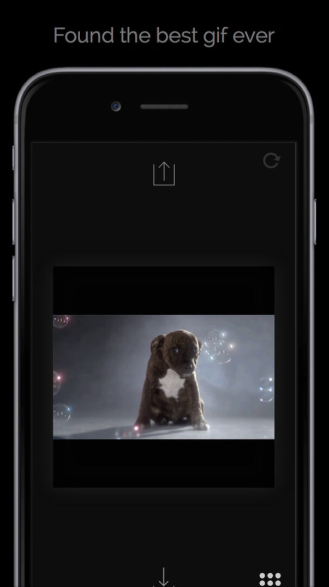
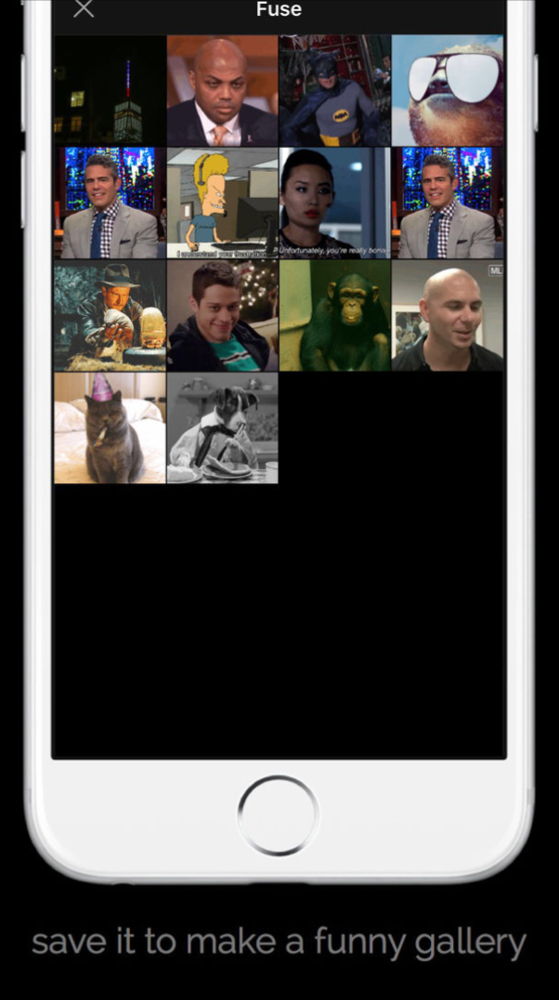
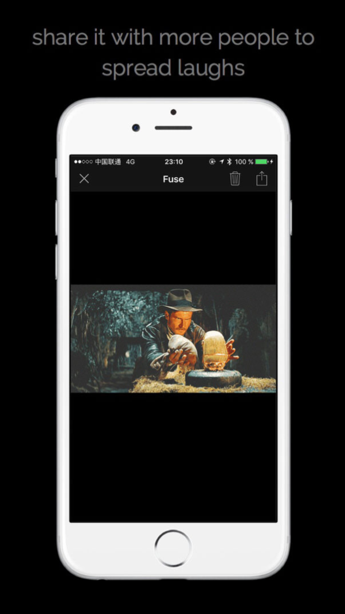

  
  
  

Fuze is a TV **GIF** player for iOS.

Whatch the trending and funniest **GIF**, and share it to spread the laughs.
Fuze is using the **REST API of giphy** to find its content.

<strong>Link:</strong> <a href="https://itunes.apple.com/fr/app/fuze/id1060486465?l=en&mt=8">AppStore</a>
