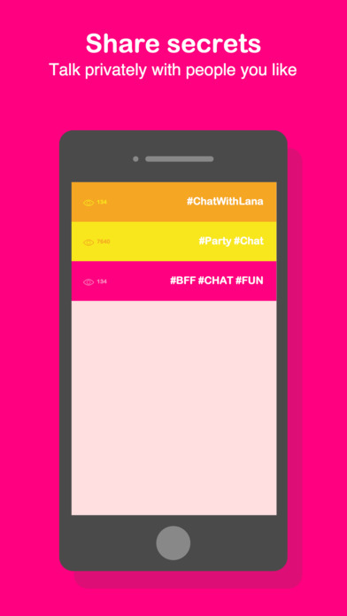
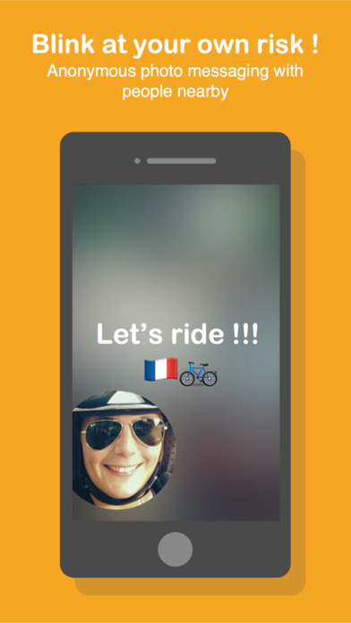
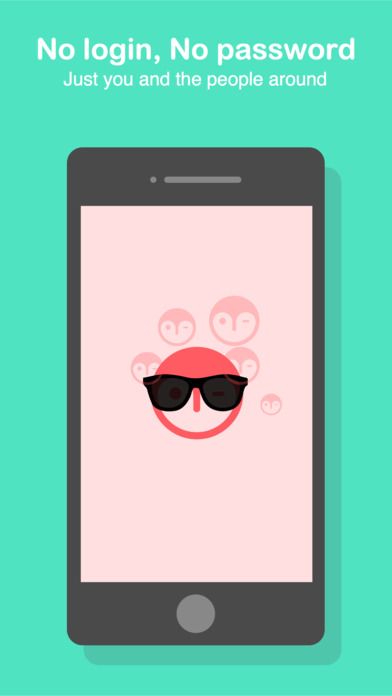
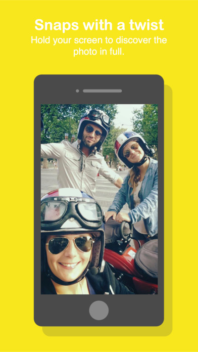

  
  
  
  

**Blink** is an anonymous *Snapchat*

Enjoy fast and fun photo messaging with people around you! Take a photo, choose your spot, add a caption, and post it on a room.

People will view it and laugh.

The room will disappear after 24h - unless someone add a new photo!

<strong>Link:</strong> <a href="https://itunes.apple.com/fr/app/blink-photo-chat-people-nearby/id1000415774?l=en&mt=8">AppStore</a>
