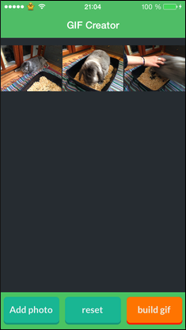

First iOS application made, for creating animated GIF on iPhone.
Using Objective-c, and AVFoundation framework.

<strong>Source:</strong> <a href="https://github.com/remirobert/gif-creator-ios"><i class="large github icon"></i>remirobert/gif-creator-ios</a>
