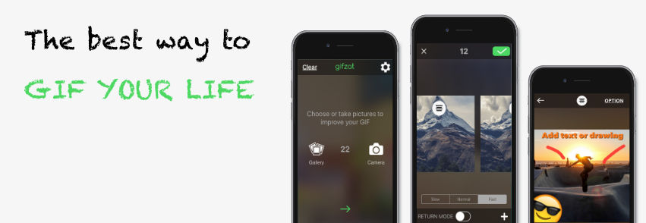

**Gifzat**  compile your images to give birth to a live media. Now, keep a dynamic record of your best moments. Don't waste photos anymore.

<strong>Source:</strong> <a href="https://github.com/remirobert/Gifzat"><i class="large github icon"></i>remirobert/Gifzat</a>
